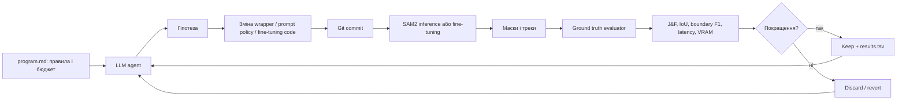
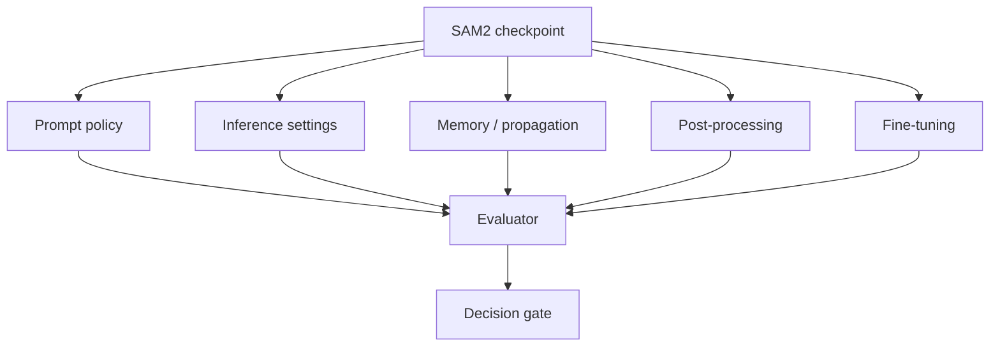

# Схема системи autoresearch для SAM2

## Замкнений цикл

## Шари пошуку

## Рекомендований порядок

1. Prompt policy: grid/random click selection, positive/negative points, box expansion, iterative correction.
2. Mask selection: score calibration, stability score, area and connected-component filters.
3. Video propagation: keyframe cadence, re-prompt on confidence drop, memory eviction.
4. Efficiency: BF16/FP16, image encoder compilation, batching, resolution and caching.
5. Fine-tuning: лише після того, як benchmark і data split стабільні.

## Контрольні точки

- До запуску: frozen checkpoint, dataset manifest і метрики.
- Після кожного кандидата: raw predictions, resources і commit.
- Перед прийняттям: held-out test і повтори.
- Після серії: error taxonomy, ablation і Pareto frontier.
